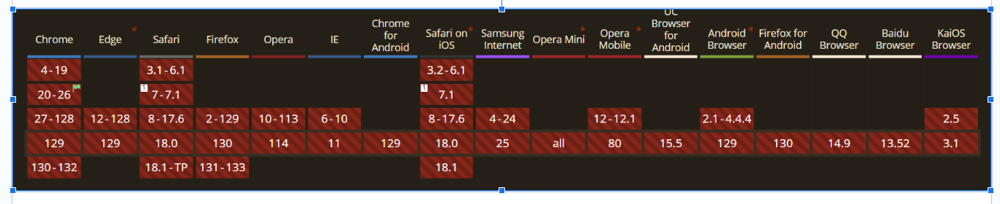
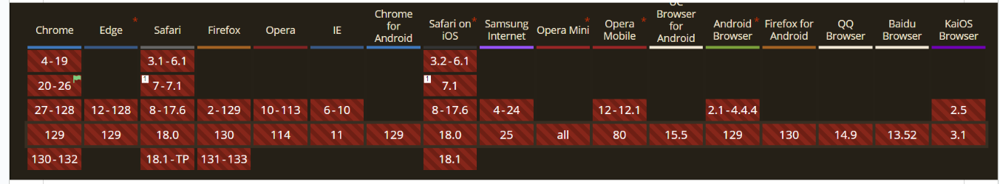
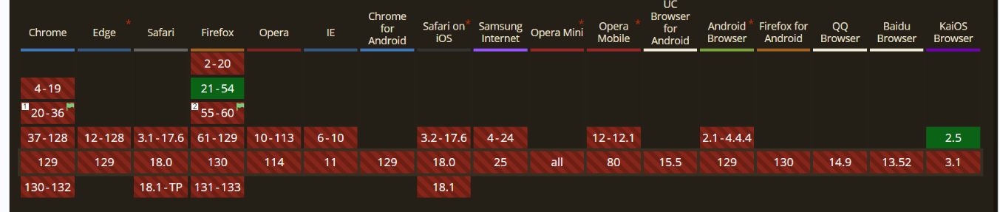

# Etiquetas HTML5.

## Ejercicio:

Los estándares HTML 5.1 y HTML 5.2 introducen etiquetas HTML nuevas. Busca dos o tres etiquetas HTML de cada estándar HTML 5.1 y 5.2 y comprueba si tu versión de navegador Google Chrome las soporta. Para comprobar si tu versión del navegador soporta las etiquetas HTML usa la siguiente URL:

https://caniuse.com/

## Resolución:

+ __5.1__

+ __5.2:__

